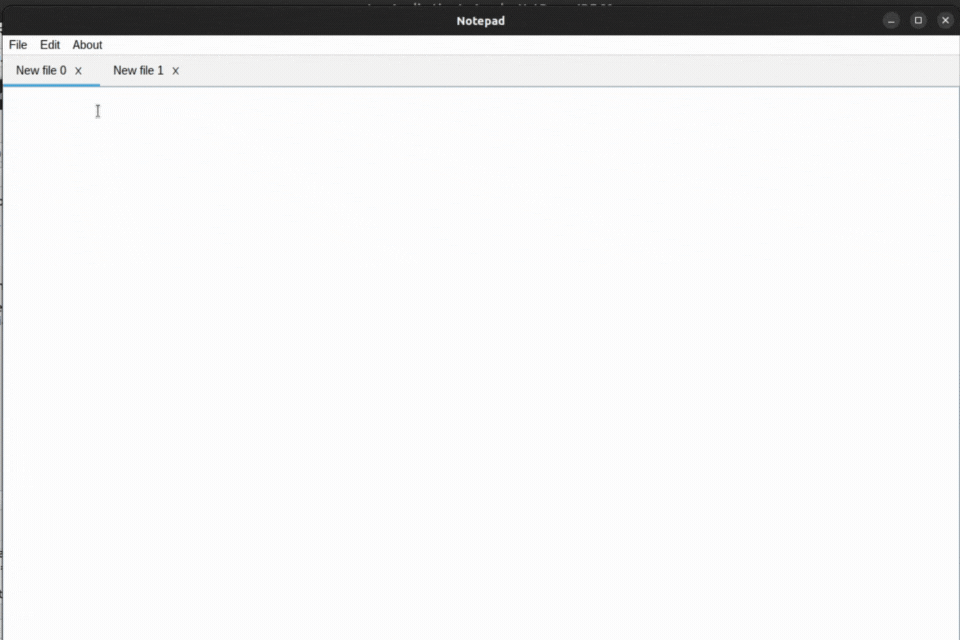
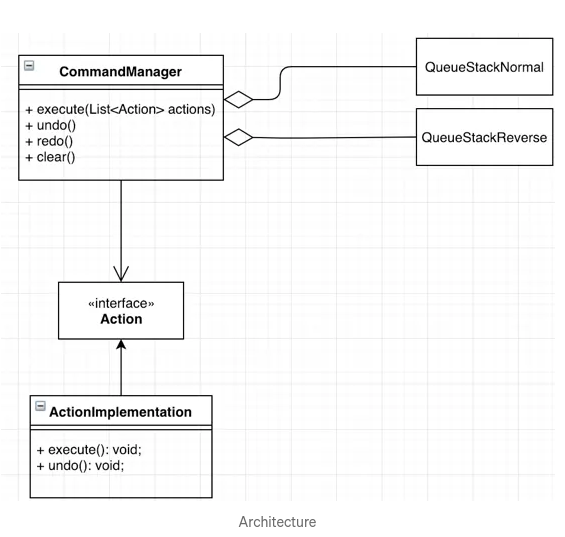
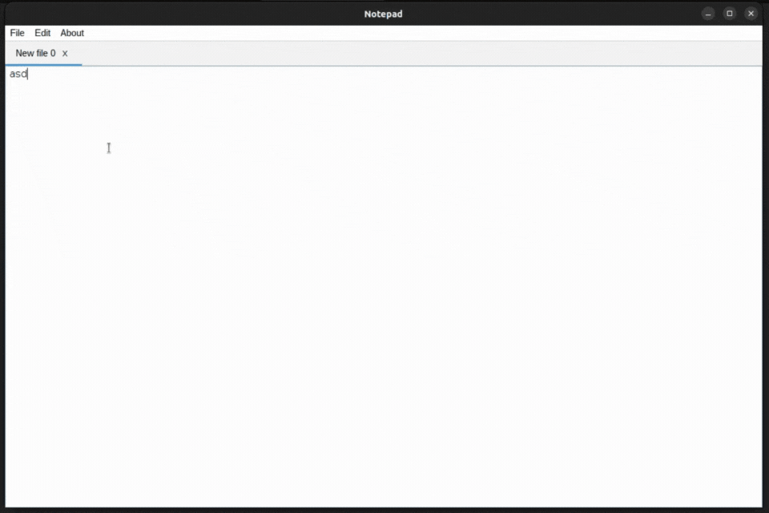
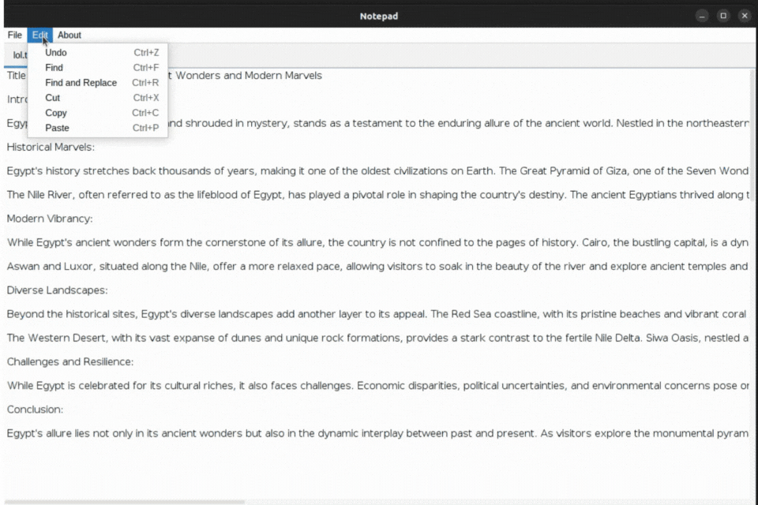
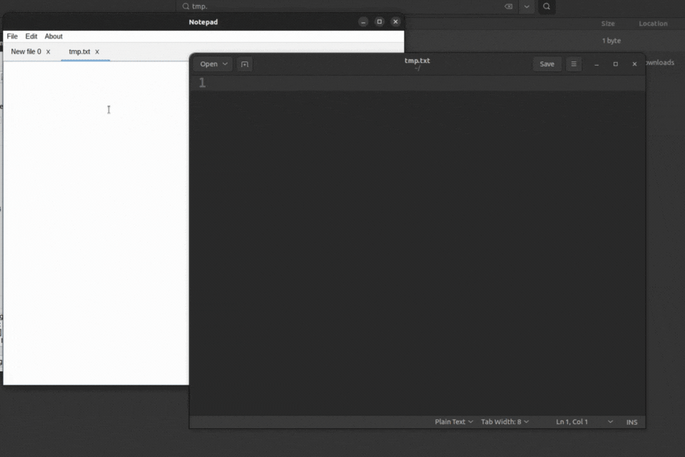

# TextEditor
A GUI plaintext editor written in Java using Swing.
# Features:
- Create, open, and save plain text documents
- Multi tab 
- undo/redo functionality
- find
- find & replace
- Auto save
***
## Create, open, and save plain text documents
- Files can be saved using the **"Open"** menu item and select the desired file using the file chooser dialog. The content of the file will then be loaded into a text area where the user can view and edit the text.
	
-  Files can be saved using the **"Save"** menu item. A **file chooser dialog** will appear where the user can specify the name and location to save the file. If the file already exists, it will be **overwritten**. ![[savefile.gif]]
***
## Multi Tab 
 
# undo/redo functionality
- Designed Undo/redo functionality using **command pattern** design pattern.

- Implemented Undo/redo functionality using **Stack** and **Rope** data structure.

## Rope
[Rope](https://en.wikipedia.org/wiki/Rope_(data_structure)#:~:text=A%20rope%20is%20a%20type,leaves%20in%20its%20left%20subtree.) is a data structure for fast manipulating with large strings. You can fast split rope into two ropes, concatenate two ropes into one, insert another rope or element, get and delete the element at a certain position. And all those operations have ***O(log(n))*** asymptotic.  
> [!NOTE]
> - My implementation of Rope data structure is based on **Treap** data structure.
### Treap 
[Treap](https://en.wikipedia.org/wiki/Treap) is a **Balanced Binary Search Tree**, but not guaranteed to have height as O(Log n). The idea is to use **Randomization** and **Binary Heap** property to maintain balance with high probability. The expected time complexity of search, insert and delete is O(Log n).
## Comparison with Vector(or String)
| Operation | Vector(or String) | Rope |
| ---- | ---- | ---- |
| `Build` | ***O(n)*** | *O(n log(n))* |
| `Insert` | *O(n m)* | ***O(m log(n))*** |
| `Erase` | *O(n)* | ***O(log(n))*** |
| `Concat` | *O(m)* | ***O(log(n))*** |

-- screenshot .git
***
# find a pattern 
 Used  **KMP string pattern search algorithm** for fast finding a pattern in just *O(n + m)*.

 | Operation | Brute force | KMP |
| ---- | ---- | ---- |
| `search` | ***O(n * m)*** | *O(n+m)* |

***
# replace & replace All

***
# Auto Save
Through keep tracing the changes of the files.

