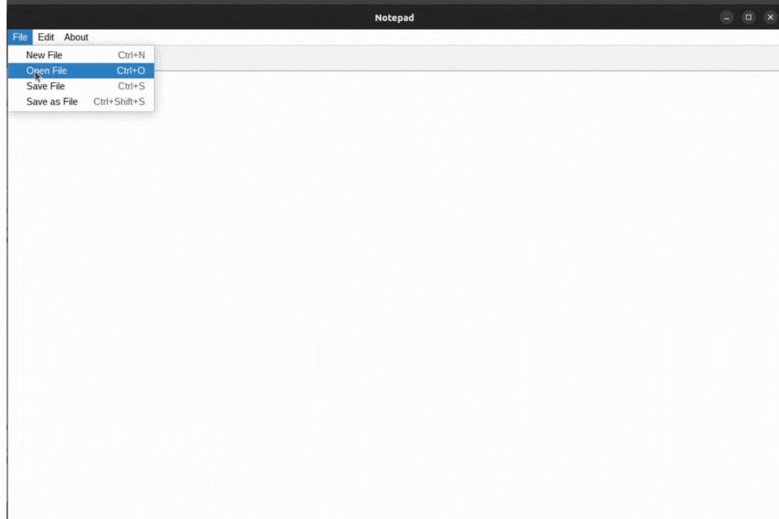

# TextEditor

A feature-rich GUI plaintext editor written in Java Swing.

## Table of Contents

- [Features](#features)
- [Installation](#installation)
- [Usage](#usage)
- [Core Features](#core-features)
- [Technical Implementation](#technical-implementation)
- [How to Contribute](#how-to-contribute)

## Features

- Create, open, and save plain text documents
- Multi-tab support
- Undo/redo functionality
- Find and replace capabilities
- Auto-save functionality

## Installation

1. Clone the repository
  
  ```bash
  git clone https://github.com/yourusername/TextEditor.git
  ```
  
2. Ensure you have Java JDK 8 or higher installed
3. Import the project into your preferred IDE

## Usage

Run the `Main.java` file in your IDE or compile and run from command line:

```bash
javac Main.java
java Main
```

## Core Features

### File Operations

<details>
<summary>Create, Open, and Save Documents</summary>

- Open files using the **"Open"** menu item and select through the file chooser dialog
- Save files using the **"Save"** menu item with automatic overwrite protection
  
  
  
  </details>
  

<details>
<summary>Multi-Tab Support</summary>

Work with multiple documents simultaneously


</details>

### Advanced Features

<details>
<summary>Find and Replace</summary>

- Implements KMP string pattern search algorithm (O(n + m) complexity)
- Supports both single and bulk replacements

**Performance Comparison:**
| Operation | Brute force | KMP |
| ---- | ---- | ---- |
| `search` | O(n * m) | O(n+m) |


</details>

<details>
<summary>Auto-Save</summary>

Automatically tracks and saves changes


</details>

## Technical Implementation

### Undo/Redo System

- Implemented using Command Pattern design pattern
- Utilizes Stack and Rope data structures
  
  

### Rope Data Structure

A specialized data structure for efficient string manipulation with O(log n) operations.

> [!NOTE]
> The Rope data structure implementation is based on Treap data structure for balanced operations.
#### Implementation Details

- Based on Treap (Balanced Binary Search Tree)
- Uses randomization and Binary Heap properties

**Performance Comparison:**
| Operation | Vector/String | Rope |
| ---- | ---- | ---- |
| Build | O(n) | O(n log n) |
| Insert | O(n m) | O(m log n) |
| Erase | O(n) | O(log n) |
| Concat | O(m) | O(log n) |

## How to Contribute

1. Fork the repository
2. Create a new branch (`git checkout -b feature/AmazingFeature`)
3. Make your changes
4. Run tests if available
5. Commit your changes (`git commit -m 'Add some AmazingFeature'`)
6. Push to the branch (`git push origin feature/AmazingFeature`)
7. Create a Pull Request

